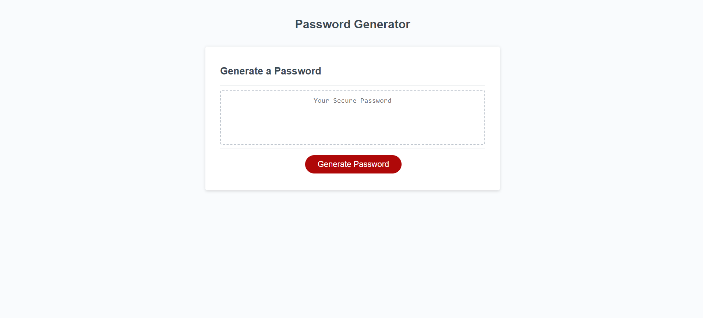

# Password Generator

## Description
The Password Generator showcases my newly learned skills in Javascript. I have learned an introduction in how Javascript can make a website more interactive and make options for the user. 
I learned how you can take the users input of numbers and boolean value, use that information to present an answer based on the users input and respond with a statement or an action. I leaned how to take information from an array and sending the user a random value from that list and that console.log() can be extremely helpful while trouble shooting trying to find an error in the code. 

## Installation
Website URL: https://kristermyr.github.io/javaScript-challenge/
Open Github: https://github.com/kristermyr/javaScript-challenge.git  

## Usage

The following acceptance criteria has been completed: 
```
GIVEN I need a new, secure password
WHEN I click the button to generate a password
THEN I am presented with a series of prompts for password criteria
WHEN prompted for password criteria
THEN I select which criteria to include in the password
WHEN prompted for the length of the password
THEN I choose a length of at least 8 characters and no more than 128 characters
WHEN asked for character types to include in the password
THEN I confirm whether or not to include lowercase, uppercase, numeric, and/or special characters
WHEN I answer each prompt
THEN my input should be validated and at least one character type should be selected
WHEN all prompts are answered
THEN a password is generated that matches the selected criteria
WHEN the password is generated
THEN the password is either displayed in an alert or written to the page
```


## Credits and resources

Salahuddin Asim 
Github: 

## Articles:
https://www.tutorialspoint.com/check-if-input-is-a-number-or-letter-in-javascript  
https://stackoverflow.com/questions/20816723/return-a-string-value-when-boolean-is-true  
https://htmlcheatsheet.com/js/  
https://www.w3schools.com/jsref/jsref_push.asp  
FreeCodeCamp challenge #48 - https://www.freecodecamp.org/learn/javascript-algorithms-and-data-structures/basic-javascript/shopping-list

## Youtube:
https://www.youtube.com/watch?v=JheVaV6bPvE&ab_channel=freeCodeCamp.org  
https://www.youtube.com/watch?v=x4HUaiazDes&ab_channel=PaulKeldsen-WebDevelopment  
https://www.youtube.com/watch?v=ssYo9t37pE4&t=369s&ab_channel=OpenJavaScript  
https://www.youtube.com/watch?v=iLx4ma8ZqvQ&ab_channel=freeCodeCamp.org  

## License

MIT License

Copyright (c) 2022 kristermyr

Permission is hereby granted, free of charge, to any person obtaining a copy
of this software and associated documentation files (the "Software"), to deal
in the Software without restriction, including without limitation the rights
to use, copy, modify, merge, publish, distribute, sublicense, and/or sell
copies of the Software, and to permit persons to whom the Software is
furnished to do so, subject to the following conditions:

The above copyright notice and this permission notice shall be included in all
copies or substantial portions of the Software.

THE SOFTWARE IS PROVIDED "AS IS", WITHOUT WARRANTY OF ANY KIND, EXPRESS OR
IMPLIED, INCLUDING BUT NOT LIMITED TO THE WARRANTIES OF MERCHANTABILITY,
FITNESS FOR A PARTICULAR PURPOSE AND NONINFRINGEMENT. IN NO EVENT SHALL THE
AUTHORS OR COPYRIGHT HOLDERS BE LIABLE FOR ANY CLAIM, DAMAGES OR OTHER
LIABILITY, WHETHER IN AN ACTION OF CONTRACT, TORT OR OTHERWISE, ARISING FROM,
OUT OF OR IN CONNECTION WITH THE SOFTWARE OR THE USE OR OTHER DEALINGS IN THE
SOFTWARE.
